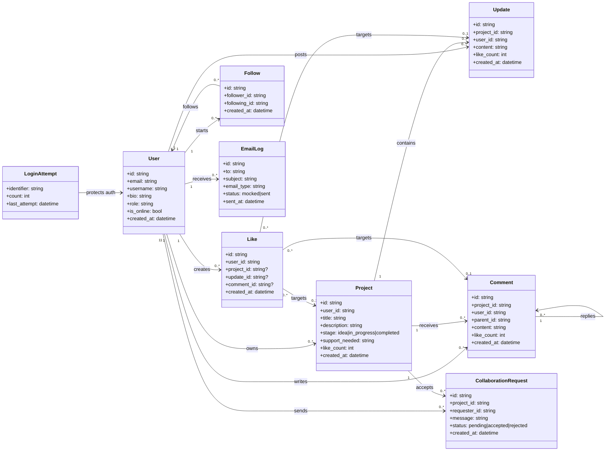
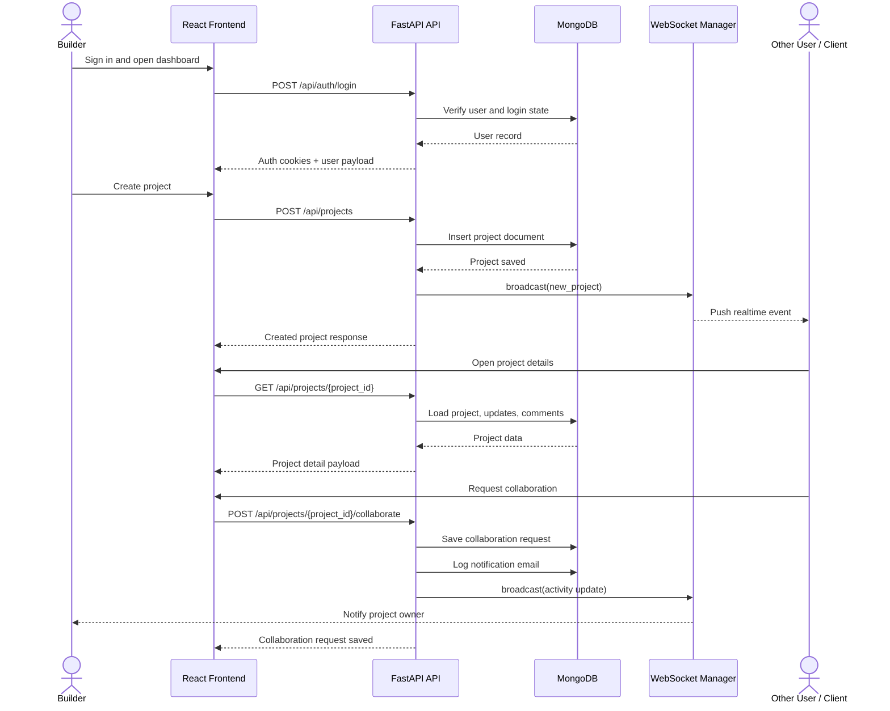

# MzansiBuilds

MzansiBuilds is a full-stack platform designed for developers who want to build in public. It provides a space to share projects, track progress, and connect with other developers.

The goal is to make development more visible and collaborative by turning projects into ongoing, interactive experiences rather than isolated work.

---

## Overview

The platform focuses on making development visible and collaborative by allowing developers to share progress, get feedback, and build alongside others. Users can create projects, post updates, interact with other developers, and follow work they find interesting.

---

## Core Features

* User authentication (register, login, logout, token refresh)
* Project creation, editing, deletion, and stage tracking
* Progress updates with comments
* Likes, follows, and collaboration requests
* Global and following-based feeds
* Celebration wall for completed projects
* Realtime activity and presence using WebSockets

---

## Architecture

```text
React (frontend) ---> FastAPI (backend) ---> MongoDB
        |                    |
        |---- HTTP API ------|
        |---- WebSocket -----|
```

### Stack

**Frontend**

* React
* React Router
* TailwindCSS
* Axios

**Backend**

* FastAPI
* Pydantic
* Motor (MongoDB async driver)

**Other**

* WebSockets for realtime updates
* MongoDB Atlas (production)
* Render (backend deployment)
* Vercel (frontend deployment)

---

## System Diagrams

### Entity Class Diagram

> Left-to-right layout is used to keep the connectors as straight as Mermaid allows.



### Sequence Diagram



---

## Project Structure

```text
backend/
  app/
    core/        configuration and database setup
    models/      request/response schemas
    routes/      API endpoints
    services/    business logic
    utils/       shared helpers

frontend/
  src/
    components/  reusable UI components
    contexts/    auth and websocket state
    pages/       main views
    lib/         API utilities

docs/            architecture and API documentation
tests/           backend tests
```

---

## Running the Project Locally

### Backend

```bash
pip install -r backend/requirements.txt
uvicorn backend.server:app --reload
```

Environment variables:

* `USE_MOCK_DB=true` (optional for local testing)
* `JWT_SECRET=your-secret`
* `FRONTEND_URL=http://localhost:3000`

---

### Frontend

```bash
cd frontend
npm install
npm start
```

---

## Testing

```bash
pytest -q
```

---

## API Overview

The backend exposes endpoints for authentication, users, projects, and social interactions.

Examples:

* `POST /api/auth/register`
* `POST /api/auth/login`
* `GET /api/projects`
* `POST /api/projects`
* `GET /api/feed`

See `docs/API_SUMMARY.md` for the full list.

---

## Deployment

**Backend (Render)**
Configured via `render.yaml` with environment variables for database and authentication.

**Frontend (Vercel)**
Uses `vercel.json` for routing and API proxying.

---

## Security

* Passwords are hashed using bcrypt
* Authentication is handled with JWT (httpOnly cookies)
* Input validation is enforced using Pydantic
* Secrets are managed through environment variables

---

## Notes

This project was built with a focus on clean structure, separation of concerns, and maintainability. The goal was to simulate a real-world full-stack setup rather than just a demo application. The system design was planned using UML diagrams before implementation to ensure clear relationships between entities and scalable architecture decisions.

---

## Documentation

* `docs/ARCHITECTURE.md` — system design and flow
* `docs/API_SUMMARY.md` — endpoint reference
